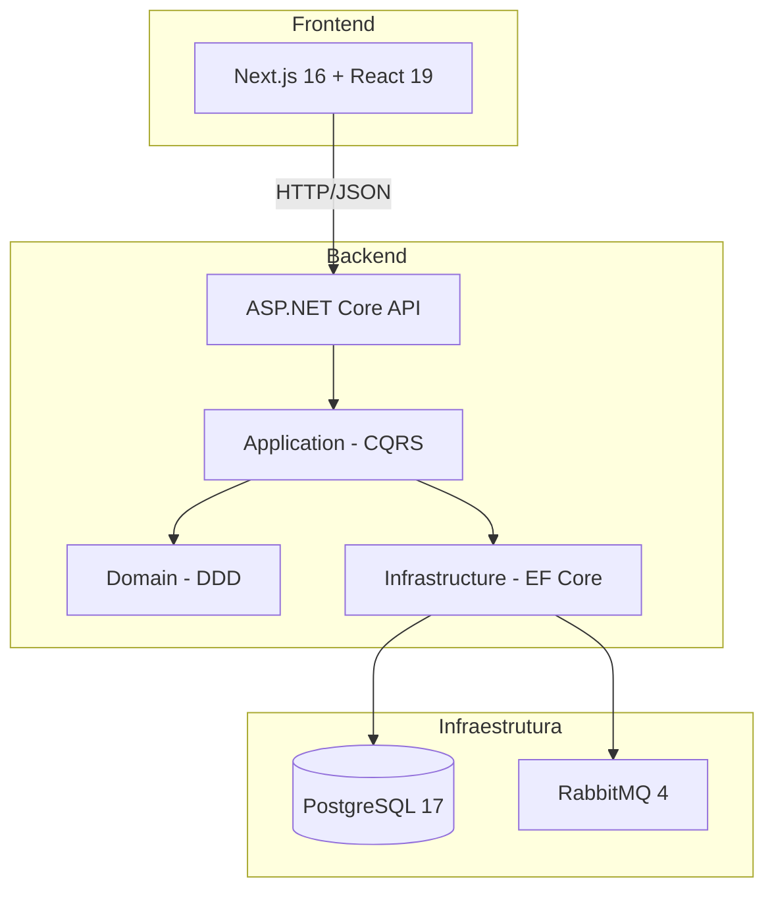
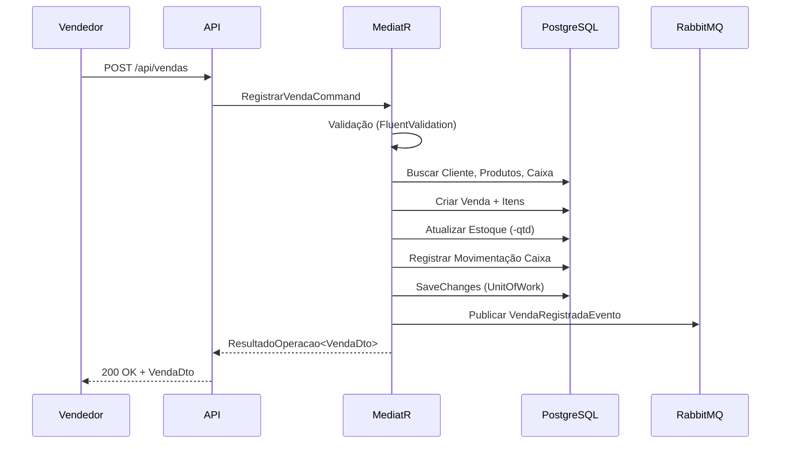
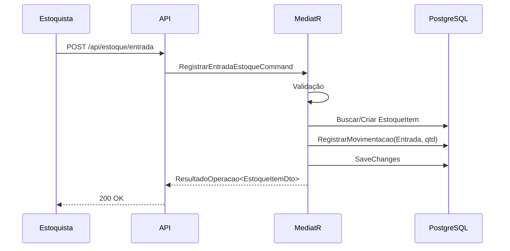
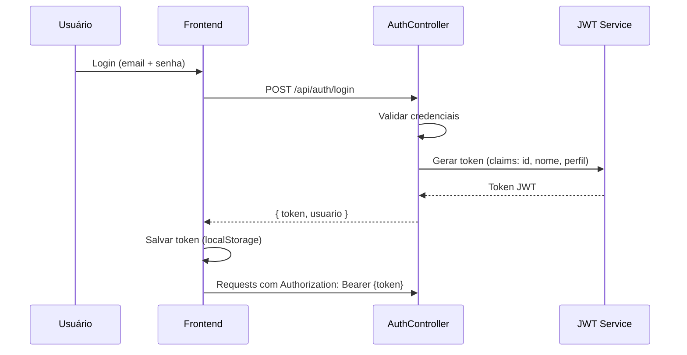
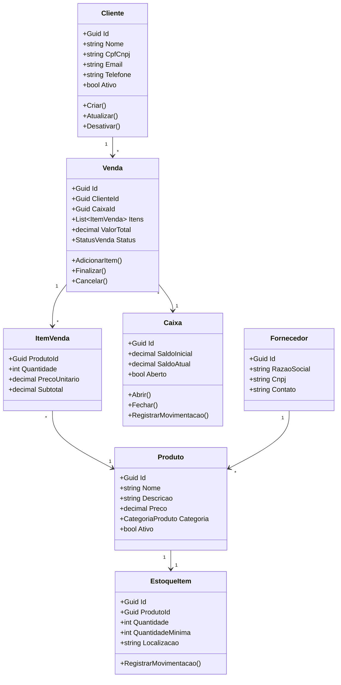

# Floricultura Gestão

Sistema de Gestão Comercial + PDV para floricultura, construído com arquitetura DDD + CQRS.

## Tecnologias

| Camada     | Tecnologia                               |
| ---------- | ---------------------------------------- |
| Backend    | .NET 10, ASP.NET Core, EF Core, MediatR  |
| Frontend   | Next.js 16, React 19, TypeScript, shadcn |
| Banco      | PostgreSQL 17                            |
| Mensageria | RabbitMQ 4                               |
| CI/CD      | Azure Pipelines                          |
| Container  | Docker Compose                           |

## Módulos

- **Clientes** — Cadastro e gestão de clientes (PF/PJ)
- **Produtos** — Catálogo de flores, arranjos e insumos
- **Estoque** — Controle de entradas/saídas com alerta de estoque baixo
- **Vendas** — Registro de vendas com múltiplos itens
- **Caixa** — Abertura/fechamento de caixa com movimentações
- **Contas a Pagar/Receber** — Gestão financeira completa

## Estrutura do Projeto

```
Floricultura-Gestao/
├── backend/
│   ├── src/
│   │   ├── FloriculturaGestao.Domain/         # Entidades, eventos, interfaces
│   │   ├── FloriculturaGestao.Application/    # CQRS commands, queries, handlers
│   │   ├── FloriculturaGestao.Infrastructure/ # EF Core, repositórios
│   │   └── FloriculturaGestao.API/            # Controllers, auth, Swagger
│   ├── Dockerfile
│   └── FloriculturaGestao.slnx
├── frontend/
│   ├── src/
│   │   ├── app/                            # Pages (App Router)
│   │   ├── components/                     # UI components (shadcn)
│   │   └── lib/                            # API client, types, contexts
│   └── Dockerfile
├── docker-compose.yml
├── azure-pipelines.yml
└── README.md
```

## Pré-requisitos

- .NET SDK 10.0+
- Node.js 22+
- Docker e Docker Compose
- PostgreSQL 17 (ou via Docker)

## Início Rápido

### 1. Clonar e configurar

```bash
git clone <repo-url>
cd Floricultura-Gestao
cp .env.example .env
# Edite .env com suas senhas
```

### 2. Subir com Docker Compose

```bash
docker compose up -d
```

Isso inicia PostgreSQL (32402), RabbitMQ (32403/32404), Backend (32401) e Frontend (32400).

O serviço `db-init` roda automaticamente a cada `docker compose up`, garantindo que o usuário de aplicação existe e tem a senha atualizada do `.env` — sem precisar recriar o volume.

### 3. Desenvolvimento Local

**Backend:**

```bash
cd backend
dotnet restore FloriculturaGestao.slnx
dotnet run --project src/FloriculturaGestao.API
```

A API estará em `https://localhost:5001` com Swagger UI.

**Frontend:**

```bash
cd frontend
npm install
npm run dev
```

O frontend estará em `http://localhost:32400`.

### 4. Primeiro administrador

Defina `BOOTSTRAP_ADMIN_EMAIL` e `BOOTSTRAP_ADMIN_PASSWORD` no `.env` antes da primeira inicialização. Não há senha padrão.

## Autenticação

JWT Bearer com 4 perfis de acesso:

- **Admin** — Acesso total ao sistema
- **Vendedor** — Clientes, produtos, vendas
- **Caixa** — Operações de caixa, vendas
- **Estoque** — Gestão de estoque e produtos

## Arquitetura

### Diagrama Geral



### Fluxo de Venda



### Fluxo de Estoque



### Fluxo de Autenticação



### Modelo de Domínio



## API Endpoints

| Método | Rota                             | Descrição                | Perfil          |
| ------ | -------------------------------- | ------------------------ | --------------- |
| POST   | /api/auth/login                  | Autenticar               | Público         |
| GET    | /api/clientes                    | Listar clientes          | Admin, Vendedor |
| GET    | /api/clientes/{id}               | Obter cliente            | Admin, Vendedor |
| POST   | /api/clientes                    | Criar cliente            | Admin, Vendedor |
| PUT    | /api/clientes/{id}               | Atualizar cliente        | Admin, Vendedor |
| GET    | /api/produtos                    | Listar produtos          | Autenticado     |
| POST   | /api/produtos                    | Criar produto            | Admin, Estoque  |
| GET    | /api/estoque                     | Listar estoque           | Autenticado     |
| GET    | /api/estoque/baixo               | Estoque abaixo do mínimo | Autenticado     |
| POST   | /api/estoque/entrada             | Registrar entrada        | Admin, Estoque  |
| POST   | /api/vendas                      | Registrar venda          | Admin, Vendedor |
| GET    | /api/vendas                      | Listar vendas            | Autenticado     |
| POST   | /api/caixa/abrir                 | Abrir caixa              | Admin, Caixa    |
| POST   | /api/caixa/{id}/fechar           | Fechar caixa             | Admin, Caixa    |
| GET    | /api/caixa                       | Listar caixas            | Autenticado     |
| GET    | /api/contas/pagar                | Listar contas a pagar    | Autenticado     |
| GET    | /api/contas/receber              | Listar contas a receber  | Autenticado     |
| POST   | /api/contas/pagar                | Criar conta a pagar      | Admin           |
| POST   | /api/contas/receber              | Criar conta a receber    | Admin, Vendedor |
| POST   | /api/contas/pagar/{id}/pagar     | Registrar pagamento      | Admin           |
| POST   | /api/contas/receber/{id}/receber | Registrar recebimento    | Admin, Caixa    |

## Variáveis de Ambiente

Veja `.env.example` para referência. **Nunca versione o `.env` com senhas reais.**

Para Docker, os principais campos de banco são:

- `POSTGRES_ADMIN_USER` e `POSTGRES_ADMIN_PASSWORD`: usuário administrador inicial do container.
- `POSTGRES_APP_USER` e `POSTGRES_APP_PASSWORD`: usuário da aplicação usado pela API.

Na primeira inicialização do PostgreSQL, o script `backend/db/init/01-create-app-user-and-grants.sh`
cria o usuário de aplicação e concede permissões de `CONNECT`, `USAGE/CREATE` no schema `public`,
além de permissões em tabelas e sequências (atuais e futuras).

O serviço `db-init` (no `docker-compose.yml`) é executado a cada `docker compose up` e sincroniza o usuário e senha da aplicação com os valores do `.env`, mesmo com volume persistente. Assim, nunca é necessário recriar o volume para aplicar mudanças de credencial.

Caso queira começar do zero (apagando todos os dados):

```bash
docker compose down -v
docker compose up -d
```

## Licença

Uso interno — todos os direitos reservados.
